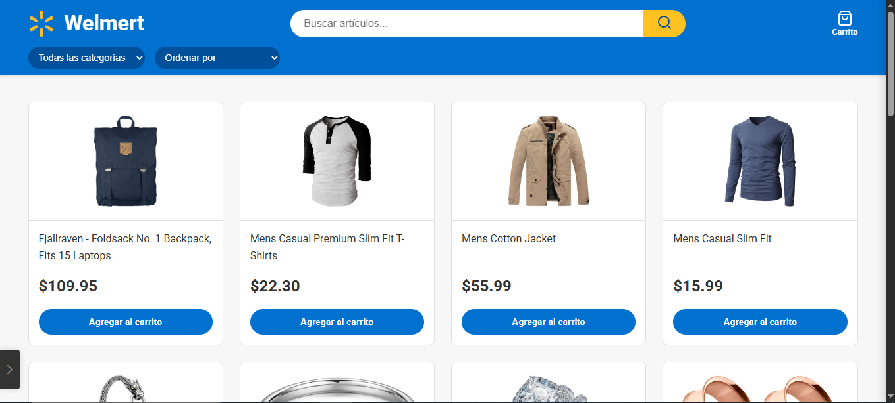
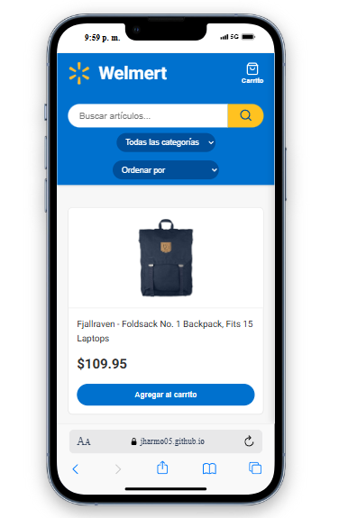
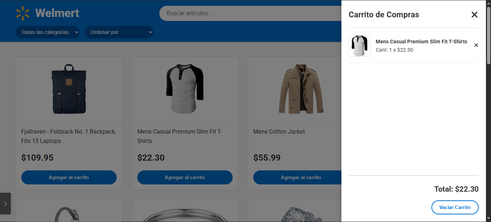

# Welmert - FakeStore API

Este proyecto es una aplicación web de comercio electrónico desarrollada con HTML, CSS y JavaScript puro. Consume los datos de la API pública [FakeStoreAPI](https://fakestoreapi.com/) para mostrar dinámicamente una lista de productos. La aplicación permite a los usuarios buscar, filtrar y ordenar los productos, así como agregarlos a un carrito de compras funcional que persiste los datos en el navegador gracias a `localStorage`.

## 🚀 Demo en Vivo

Puedes ver el proyecto en acción aquí:
**[https://jharmo05.github.io/SHOPPING-WELMERT/](https://jharmo05.github.io/SHOPPING-WELLMERT/)**

## 📋 Instrucciones para Ejecutar

Para ejecutar este proyecto en tu máquina local, sigue estos sencillos pasos:

1.  **Clona el repositorio:**
    ```bash
    git clone [https://github.com/jharmo05/WEB-COMPRAS1.git](https://github.com/jharmo05/WEB-COMPRAS1.git)
    ```

2.  **Navega al directorio del proyecto:**
    ```bash
    cd WEB-COMPRAS1
    ```

3.  **Abre el archivo `index.html` en tu navegador.**
    * **Recomendación:** Para evitar posibles problemas de CORS al realizar peticiones `fetch` a la API desde un archivo local, se recomienda usar un servidor en vivo. Si usas Visual Studio Code, puedes instalar la extensión **"Live Server"** y hacer clic en "Go Live" en la parte inferior derecha del editor.

## 📸 Capturas de Pantalla


#### Vista de Escritorio


#### Vista Móvil y Responsiva


#### Carrito de Compras


---

## 🎨 Diseño y Análisis

### 🖌️ Bocetos y Wireframes

El diseño inicial y los wireframes de la interfaz se realizaron en **Canva** para definir la estructura, la disposición de los componentes y el flujo del usuario antes de escribir el código.

**[Ver Wireframes en Canva](https://www.canva.com/design/DAGqzZ9E2pM/0y8WJwc4Nve3ULSvisV6hQ/edit)**

### 💡 Decisiones de Interfaz y Experiencia de Usuario (UI/UX)

* **Diseño Limpio y Familiar:** Se optó por una paleta de colores inspirada en grandes minoristas (azul y amarillo) para generar una sensación de familiaridad y confianza. El diseño es minimalista para centrar la atención en los productos.
* **Navegación Persistente:** El encabezado (`header`) es fijo (`position: sticky`), lo que garantiza que la barra de búsqueda y el botón del carrito estén siempre accesibles sin importar cuánto se desplace el usuario.
* **Feedback Visual:** Se implementaron efectos `hover` sutiles en las tarjetas de productos y botones para que el usuario reciba una confirmación visual de que los elementos son interactivos.
* **Carrito de Compras Accesible:** El carrito se implementó como una barra lateral que se desliza desde la derecha. Este patrón es ideal para la usabilidad, ya que no saca al usuario de la página de compras y funciona de manera excelente tanto en escritorio como en dispositivos móviles. Se puede cerrar de tres maneras intuitivas: con el botón 'X', haciendo clic en el fondo sombreado (overlay) o presionando de nuevo el ícono del carrito.
* **Diseño Responsivo (Mobile-First):** La interfaz está diseñada para ser completamente funcional en dispositivos móviles. La cuadrícula de productos se adapta automáticamente al ancho de la pantalla, y los elementos de navegación se reorganizan para optimizar el espacio en pantallas pequeñas.

## 🗂️ Estructura del Proyecto

El repositorio está organizado de la siguiente manera para mantener una separación clara de responsabilidades:

```
/
|-- 📄 index.html    # Contiene la estructura principal y el esqueleto de la página web (DOM).
|-- 🎨 style.css     # Define todos los estilos, el diseño responsivo y la apariencia visual.
|-- ⚙️ main.js       # Contiene toda la lógica de la aplicación: consumo de API, manipulación
|                   # del DOM, gestión del carrito, filtros y persistencia de datos.
|-- README.md       # La documentación que estás leyendo.
```

## 🔧 Tecnologías Utilizadas

Este proyecto fue construido utilizando tecnologías web estándar del lado del cliente, sin depender de frameworks o librerías externas para la lógica principal.

* **HTML5:** Para la estructura semántica del contenido.
* **CSS3:** Para el diseño y la estilización visual.
    * **Flexbox y Grid Layout:** Para la maquetación de componentes y la cuadrícula de productos.
    * **Variables CSS (Custom Properties):** Para un manejo de temas y colores más mantenible y consistente.
    * **Media Queries:** Para lograr un diseño completamente responsivo.
* **JavaScript (ES6+):** Para toda la interactividad y lógica de la aplicación.
    * **Fetch API:** Para realizar las peticiones a la FakeStore API de forma asíncrona.
    * **Async/Await:** Para manejar las promesas de una manera más limpia y legible.
    * **LocalStorage API:** Para la persistencia de los datos del carrito de compras en el navegador.
* **APIs y Herramientas Externas:**
    * **FakeStore API:** Como fuente de datos de los productos.
    * **Google Fonts:** Para la tipografía 'Roboto'.
    * **Canva:** Para la creación de los wireframes y el diseño inicial.

### 📊 Estructura de Datos

La lógica de la aplicación se gestiona con dos estructuras de datos principales en JavaScript:

1.  **`todosLosProductos` (Array):**
    * Un arreglo que almacena la lista completa de objetos de producto tal como se reciben de la API.
    * Actúa como la "única fuente de verdad" para los productos, desde la cual se realizan todos los filtros y búsquedas.
    * Ejemplo de un producto en el array:
        ```javascript
        {
            "id": 1,
            "title": "Fjallraven - Foldsack No. 1 Backpack, Fits 15 Laptops",
            "price": 109.95,
            "description": "Your perfect pack for everyday use and walks in the forest...",
            "category": "men's clothing",
            "image": "[https://fakestoreapi.com/img/81fPKd-2AYL._AC_SL1500_.jpg](https://fakestoreapi.com/img/81fPKd-2AYL._AC_SL1500_.jpg)",
            "rating": {"rate":3.9, "count":120}
        }
        ```

2.  **`carrito` (Objeto):**
    * Un objeto que representa el carrito de compras. Se eligió un objeto en lugar de un array para optimizar la búsqueda y actualización de productos.
    * La **clave** de cada entrada es el `id` del producto. Esto permite verificar instantáneamente si un producto ya existe en el carrito y actualizar su cantidad sin tener que recorrer un arreglo.
    * El **valor** es un objeto que contiene toda la información del producto más una propiedad `quantity`.
    * Ejemplo de la estructura del carrito:
        ```javascript
        {
          "1": { "id": 1, "title": "Fjallraven Backpack...", "price": 109.95, "quantity": 1 },
          "4": { "id": 4, "title": "Casio Men's Watch...", "price": 168, "quantity": 2 }
        }
        ```

### ⚙️ Justificación de Filtros y Ordenamientos

Las funcionalidades de filtrado y ordenamiento se implementaron para mejorar la usabilidad y permitir a los usuarios encontrar productos de manera eficiente:

* **Filtro por Categoría:** Es la herramienta de descubrimiento más importante. Permite a los usuarios que no tienen un producto específico en mente explorar secciones de su interés, replicando la experiencia de compra en una tienda física.
* **Búsqueda por Texto (`input`):** Esencial para usuarios que ya saben lo que quieren. La actualización en tiempo real (evento `input`) ofrece una experiencia fluida y resultados instantáneos.
* **Ordenamiento:**
    * **Precio (Menor a Mayor / Mayor a Menor):** Es una de las funcionalidades más utilizadas en cualquier e-commerce. Se adapta tanto a usuarios que buscan las mejores ofertas como a aquellos que buscan productos de mayor gama.
    * **Nombre (A-Z / Z-A):** Útil para encontrar productos cuando se conoce el nombre o parte de él, permitiendo una búsqueda alfabética sencilla.

## ✍️ Autor

Este proyecto fue creado por **[Sebastian Ardila](mailto:jhonsebastian345@gmail.com)**.


